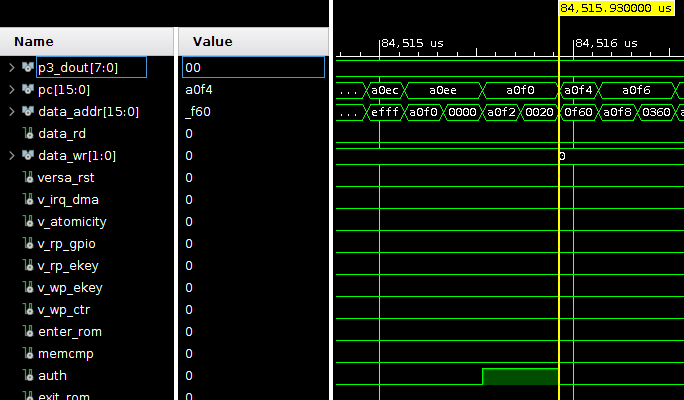
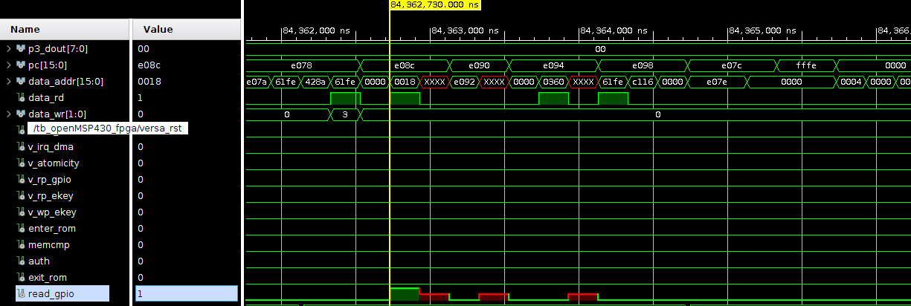
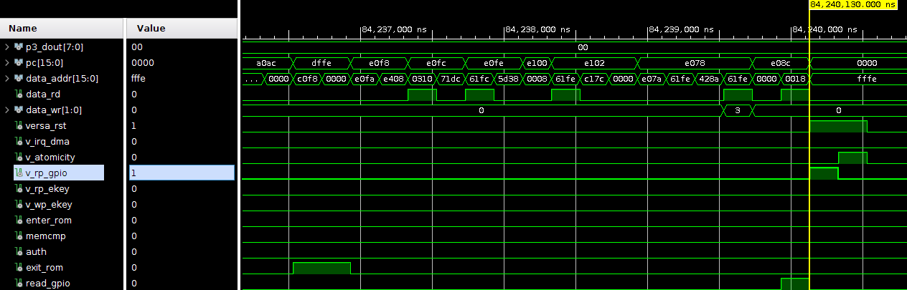

# VERSA Formally Verified Implementation:

**[This repository is still under construction]**
**[To appear in IEEE S&P'22]**

With the growing popularity of the Internet-ofThings (IoT), massive (and growing) numbers of specialized
devices are deployed worldwide, in many everyday settings,
including homes, offices, vehicles, public spaces, and factories.
Such devices usually perform sensing and/or actuation. Many of
them handle sensitive and personal data. If left unprotected, even
seemingly innocuous information (e.g., temperature, motion, or
sound) can leak very private information. At the same time, some
IoT devices use low-end computing platforms with few, if any,
security features.

Numerous techniques were proposed to secure sensed data,
e.g., by authenticating communication end-points, encrypting
data before transmission, and obfuscating traffic patterns. Such
techniques protect sensitive data from external adversaries,
assuming that the device itself is secure. The high frequency
and large scale of IoT compromises and exploits, prompts a
natural question: how to protect sensed data if the device’s
software state is compromised? We refer to this problem as
Privacy-from-Birth (PfB), meaning that solving it requires
protecting sensed data from its very genesis, i.e., from the time
when a physical analog quantity is converted into its digital
counterpart and becomes accessible to software.

In this work, we formalize PfB and design Verified Remote
Sensing Authorization (VERSA) – a provably secure and formally
verified sensor architecture guaranteeing that only correct execution of 
expected and explicitly authorized software can access
and manipulate sensing interfaces, specifically, General Purpose
Input/Output (GPIO), which is the usual boundary between
analog and digital worlds on embedded devices. This guarantee
is obtained from minimal hardware support and holds even if all
device software is compromised. VERSA ensures that malware can
neither gain access to sensed data on the GPIO-mapped memory
nor obtain any trace of it. Our VERSA implementation is formally
verified and open-sourced, targeting resource-constrained sensors
commonly used at the IoT edges. Experimental results show that
PfB is both achievable and affordable even on these devices.

### VERSA Directory Structure

	├── msp_bin
	├── openmsp430
	│   ├── contraints_fpga
	│   ├── fpga
	│   ├── msp_core
	│   ├── msp_memory
	│   ├── msp_periph
	│   └── simulation
	├── scripts
	│   ├── build
	│   ├── build-verif
	│   └── verif-tools
	├── test
	│   └── simulation
	├── utils
	├── verification_specs
	│   └── soundness_and_security_proofs
	└── vrased
		├── hw-mod
		│   └── hw-mod-auth
		└── sw-att
		    └── hacl-c

## Dependencies Installation

Environment (processor and OS) used for development and verification:
Intel i7-3770
Ubuntu 18.04.3 LTS

Dependencies on Ubuntu:

		sudo apt-get install bison pkg-config gawk clang flex gcc-msp430 iverilog tcl-dev
		cd scripts
		sudo make install

## Building VERSA Software
To generate the Microcontroller program memory configuration containing VERSA trusted software (ROM code) and sample application we are going to use the Makefile inside the scripts directory:

        cd scripts

This repository has a test application, provided in the test folder. To build VERSA for a this test application, run:

        make test

Note that this step will not run any simulation, but simply generate the MSP430 binaries corresponding to the test-case of choice.
As a result of the build, two files pmem.mem and smem.mem should be created inside msp_bin directory:

- pmem.mem program memory contents corresponding to the application binaries

- smem.mem contains ROM binary.

In the next steps, during synthesis, these files will be loaded to the MSP430 memory when we either: deploy VERSA on the FPGA or run VERSA simulation using VIVADO simulation tools.

If you want to clean the built files run:

        make clean

Note: Latest Build tested using msp430-gcc (GCC) 4.6.3 2012-03-01

## Creating a VERSA project on Vivado and Running Synthesis

This is an example of how to synthesize and prototype VERSA using Basys3 FPGA and XILINX Vivado v2019.2 (64-bit) IDE for Linux

- Vivado IDE is available to download at: https://www.xilinx.com/support/download.html

- Basys3 Reference/Documentation is available at: https://reference.digilentinc.com/basys3/refmanual

#### Creating a Vivado Project for VERSA

1 - Clone this repository;

2 - Follow the steps in [Building VERSA Software](#building-VERSA-software) to generate .mem files for the application of your choice.

2- Start Vivado. On the upper left select: File -> New Project

3- Follow the wizard, select a project name and location. In project type, select RTL Project and click Next.

4- In the "Add Sources" window, select Add Files and add all *.v and *.mem files contained in the following directories of this reposiroty:

        openmsp430/fpga
        openmsp430/msp_core
        openmsp430/msp_memory
        openmsp430/msp_periph
        /vrased/hw-mod
        /msp_bin

and select Next.

Note that /msp_bin contains the pmem.mem and smem.mem binaries, generated in step [Building VERSA Software].

5- In the "Add Constraints" window, select add files and add the file

        openmsp430/contraints_fpga/Basys-3-Master.xdc

and select Next.

        Note: this file needs to be modified accordingly if you are running VERSA in a different FPGA.

6- In the "Default Part" window select "Boards", search for Basys3, select it, and click Next.

        Note: if you don't see Basys3 as an option you may need to download Basys3 to your Vivado installation.

7- Select "Finish". This will conclude the creation of a Vivado Project for VERSA.

Now we need to configure the project for systhesis.

8- In the PROJECT MANAGER "Sources" window, search for openMSP430_fpga (openMSP430_fpga.v) file, right click it and select "Set as Top".
This will make openMSP430_fpga.v the top module in the project hierarchy. Now its name should appear in bold letters.

9- In the same "Sources" window, search for openMSP430_defines.v file, right click it and select Set File Type and, from the dropdown menu select "Verilog Header".

Now we are ready to synthesize openmsp430 with VERSA hardware the following step might take several minutes.

10- On the left menu of the PROJECT MANAGER click "Run Synthesis", select execution parameters (e.g, number of CPUs used for synthesis) according to your PC's capabilities.

11- If synthesis succeeds, you will be prompted with the next step to "Run Implementation". You *do not* to "Run Implementation" if you only want simulate VERSA.
"Run implementation" is only necessary if your purpose is to deploy VERSA on an FPGA.

If you want to deploy VERSA on an FPGA, continue following the instructions on [Deploying VERSA on Basys3 FPGA].

If you want to simulate VERSA using VIVADO sim-tools, continue following the instructions on [Running VERSA on Vivado Simulation Tools].

## Running VERSA on Vivado Simulation Tools

After completing the steps 1-10 in [Creating a Vivado Project for VERSA]:

1- In Vivado, click "Add Sources" (Alt-A), then select "Add or create simulation sources", click "Add Files", and select everything inside openmsp430/simulation.

2- Now, navigate "Sources" window in Vivado. Search for "tb_openMSP430_fpga", and *In "Simulation Sources" tab*, right-click "tb_openMSP430_fpga.v" and set its file type as top module.

3- Go back to Vivado window and in the "Flow Navigator" tab (on the left-most part of Vivado's window), click "Run Simulation", then "Run Behavioral Simulation".

4- On the newly opened simulation window, select a time span for your simulation to run (see times for each default test-case below) and the press "Shift+F2" to run.

5- In the green wave window you will see values for several signals. The imporant ones are "versa_reset", and "pc[15:0]". pc cointains the program counter value.

In Vivado simulation, the final value of pc[0:15] should correspond to '0xfffe' instruction address inside "main" function of test's main.c, which indicates that program successfully authenticated, read GPIO input and encryption key and returned from it.

To determine the start and end address (values of ER_min and ER_max, per VERSA's paper) of 'test' application function (in main.c) one can check the compilation file at scripts/tmp-build/test/vrased.lst. In this file search for the name of the function which is "application".

In the simulation window, approximately around time = 83ms one should be able to see that test application reads from GPIO and eKR (encryption key region) and returns to main function with result in register r15. 

## Deploying VERSA on Basys3 FPGA

1- After Step 10 in [Creating a Vivado Project for VERSA], select "Run Implementation" and wait until this process completes (typically takes around 1 hour).

2- If implementation succeeds, you will be prompted with another window, select option "Generate Bitstream" in this window. This will generate the bitstream that is used to step up the FPGA according to VERSA hardware and software.

3- After the bitstream is generated, select "Open Hardware Manager", connect the FPGA to you computer's USB port and click "Auto-Connect".
Your FPGA should be now displayed on the hardware manager menu.

        Note: if you don't see your FPGA after auto-connect you might need to download Basys3 drivers to your computer.

4- Right-click your FPGA and select "Program Device" to program the FPGA.

### Description of Provided test application named "test"

This is a sample application to test whether software is able to read GPIO after successful authorization by VERSA. If the provided AToken in the main.c file is generated from the application function of this test program, then VERSA grants privileges for this function to read GPIO and encryption key. The application (after authorization) reads the GPIO input and does One-Time-Pad encryption of it with the derived encryption key in eKR region.

#### 5- Examples of simulation test-cases are provided below.

- Simulation window showing successful authentication of test application:

- Simulation window showing successful read from GPIO from test application: 

- Simulation window showing failure to read from GPIO from test application (due to failure to authenticate): 

## Running VERSA Verification

To check HW-Mod against VERSA LTL subproperties using NuSMV run:

        make verify

Note that running make verify proofs may take several hours (Time may very widely depending on the setup, e.g., 4 hours minutes on a Ubuntu18 VM with 32GB of RAM).

To run VERSA end-to-end implementation proofs check the readme file in:

        verification_specs/soundness_and_security_proofs

To run end-to-end proofs you also need to install Spot: https://spot.lrde.epita.fr/install.html
